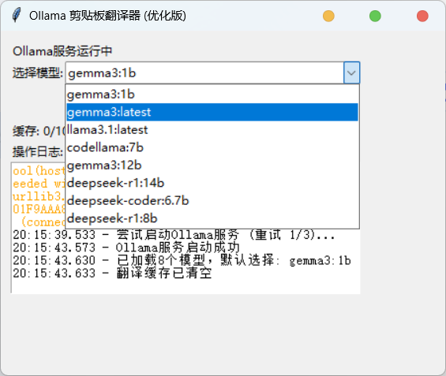
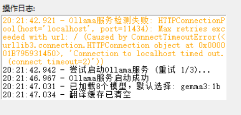

# Ollama 剪贴板翻译器


[](https://ollama.ai)

一个基于 Ollama 本地 AI 模型的剪贴板翻译工具，支持实时监控、智能缓存和高效翻译。



## 功能演示
| 监控状态 | 翻译弹窗 |
|----------|----------|
|  |  |

## 功能特点

✨ **核心功能**
- 实时监控剪贴板内容变化
- 调用本地 Ollama 模型进行翻译
- 智能识别中英文避免重复翻译
- 翻译结果弹窗显示（始终置顶）

⚡ **性能优化**
- 防抖节流双重控制（200ms/500ms）
- LRU 缓存最近 100 条翻译结果
- 优化的中文检测算法
- 异步处理不阻塞主界面

🛡️ **稳定可靠**
- 自动检测 Ollama 服务状态
- 指数退避重试机制（最大3次）
- 详尽的错误日志记录
- 崩溃后自动恢复

## 安装指南

### 前置要求
1. 安装 [Ollama](https://ollama.ai) 并至少下载一个模型：
   ```bash
   ollama pull llama3
   ```
2. Python 3.8 或更高版本

### 安装步骤
1. 克隆仓库：
   ```bash
   git clone https://github.com/xiang-ys/Based_on_ollama_local_deployment_translation_clipboard_for_Chinese.git
   cd ollama-translator
   ```

2. 安装依赖：
   ```bash
   pip install -r requirements.txt
   ```

3. 启动 Ollama 服务（如果尚未运行）：
   ```bash
   ollama serve
   ```

4. 运行翻译器：
   ```bash
   python translator_gui.py
   ```

## 使用方法

1. **主界面操作**：
   - 从下拉菜单选择 Ollama 模型
   - 点击"开始监控"按钮
   - 通过日志面板查看实时状态

2. **翻译流程**：
   1. 复制任意文本到剪贴板
   2. 等待 200-500ms（防抖节流）
   3. 弹窗显示翻译结果
   4. 选择"复制"或"关闭"

3. **快捷键建议**：
   - 推荐搭配系统剪贴板管理器使用
   - 可绑定全局快捷键快速唤出

## 高级配置

通过修改源码中的常量值自定义行为：

```python
# 性能参数
CHECK_INTERVAL = 0.1     # 剪贴板检查间隔(秒)
DEBOUNCE_DELAY = 200     # 防抖延迟(毫秒)
THROTTLE_DELAY = 500     # 节流间隔(毫秒)

# 资源控制
MAX_CACHE_SIZE = 100     # 最大缓存条目数
MAX_RETRIES = 3          # 最大重试次数
```

## 常见问题

❓ **弹窗没有出现**
- 检查 Ollama 服务是否运行
- 查看日志文件 `translation_log.txt`
- 确保没有防火墙阻止本地11434端口

❓ **翻译结果不准确**
- 尝试更换更大/更专业的模型
- 检查模型是否完整下载：
  ```bash
  ollama list
  ```

❓ **CPU/内存占用高**
- 降低监控频率（增大 CHECK_INTERVAL）
- 使用更小的模型
- 减少缓存大小

## 贡献指南

欢迎提交 Issue 或 PR！建议贡献方向：
- 添加更多语言支持
- 实现配置文件系统
- 开发打包版本（如.exe/.dmg）

## 许可证

本项目采用 [MIT 许可证](LICENSE)

---
> 由 [xiang_ys] 开发 · [报告问题](https://github.com/xiang-ys/Based_on_ollama_local_deployment_translation_clipboard_for_Chinese.git)